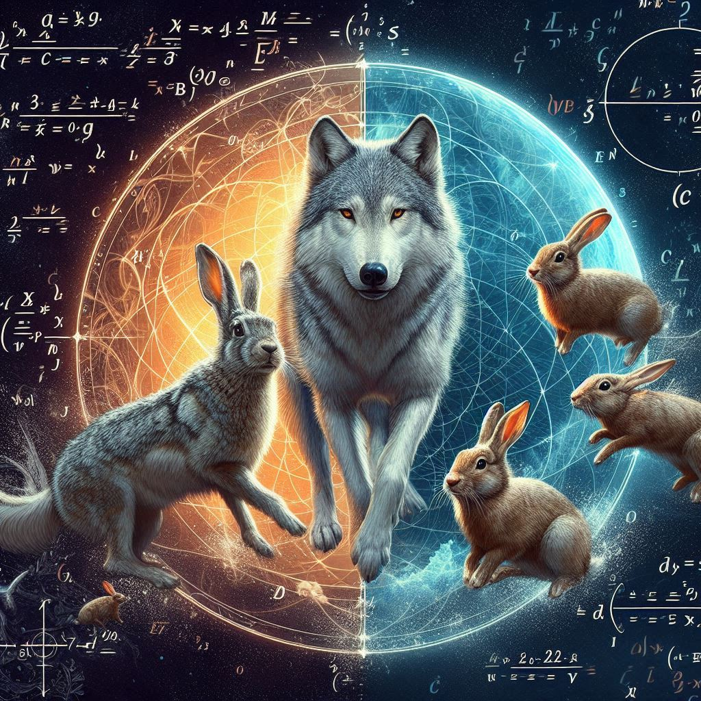

# Trabajo Final: Ecuaciones Diferenciales Ordinarias

En este trabajo final del curso de **Ecuaciones Diferenciales Ordinarias**, se explorarán los conceptos fundamentales de las ecuaciones diferenciales y su aplicación en problemas del mundo real.

Se presentarán las conclusiones principales del trabajo y se discutirán las implicaciones de los hallazgos para la investigación futura en ecuaciones diferenciales ordinarias.
